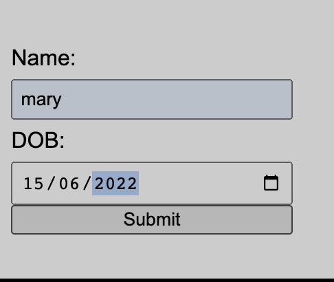
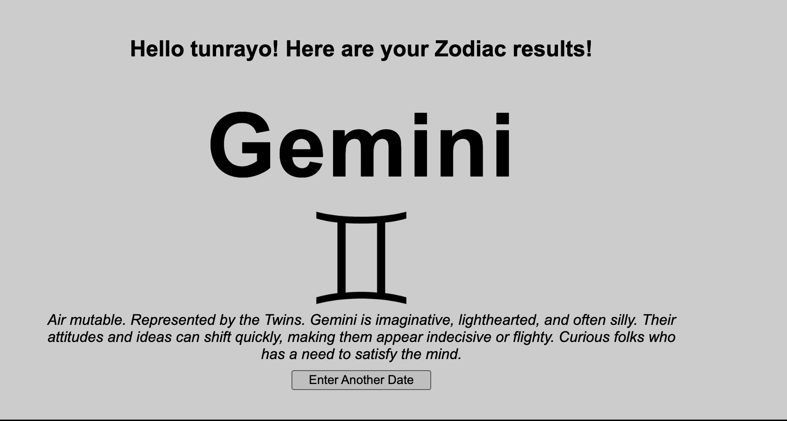

---
  > ### **OVERVIEW:** 
  >
  > **This is a group project by certain members of the 100Devs community.**
  >
  > **Contributors**
  > 
  > Lee Gill | *GitHub:* LeeGee64 | *Twitter:* @LeeGee64 | *LinkedIn:* linkedin.com/in/leland-gill 
---

# ZODIAC  SIGN Project
This project is a user friendly project that provides the accurate constellation name of the user. Basically the user inputs his/her date of birth in the input field provided and the zodiac name and description is returned to the user.

# How It's Made
This project was created using the following technologies:- HTML, JAVASCRIPT, CSS, NODE.js, Json

# The Process
Firstly, a form element with date input was created for users to enter their name and their birthday using the `dd/mm/yyyy` format. Then we built an array of objects containing the data for each zodiac sign including: names, decriptions, and images. When a user enters their birthdate, their zodiac constellation name, associated images and description is returned by filtering through the zodiac array via a conditional based on the entered date and month.

# Optimization
  * *Server Refractoring:* Currently, our server serves content individualy by specific file name. In a future iteration, it would be ideal to have requests be handled by directory to reduce the amount of code in our server file and cut down any possible errors.
  * *App Aesthetics:* Upgrading css style to make the form and result elements of the app more modern in design. The introduction of a techonology like REACT might help in this area.
  * *Introduction of User Profiles:* As the information the app provides the user becomes more complex, it would be ideal to have users be able to create profiles where their Zodiac information can be saved for later.
  * *Expanded Results Description:* Modern astrology-focused sites offer users comprehensive guides on how their star signs can influence their romantic, financial, and social lives. With a future update, this app will be able to return contex-sensitive information based on what the user requests via menu.

# Lessons Learned
  * *Team Collaboration:* With a team made up of volunteer engineers from different parts of the globe bringing different skillsets and perspectives, managing the programming effort for this app was an ad-hoc exercise in communication, coordination, and group problem-solving. By maintaining regular contact via Slack and Discord-- as well as identifying areas of improvement with the project with Issues-- we were able to complete the app and test its functionality.
  

# Resources Used 
  * Github
  * Personal Machines
  * Slack
  * Discord
  * Heroku
  
# TECH USED
  * HTML
  * CSS
  * JAVASCRIPT
  * NODE.js
